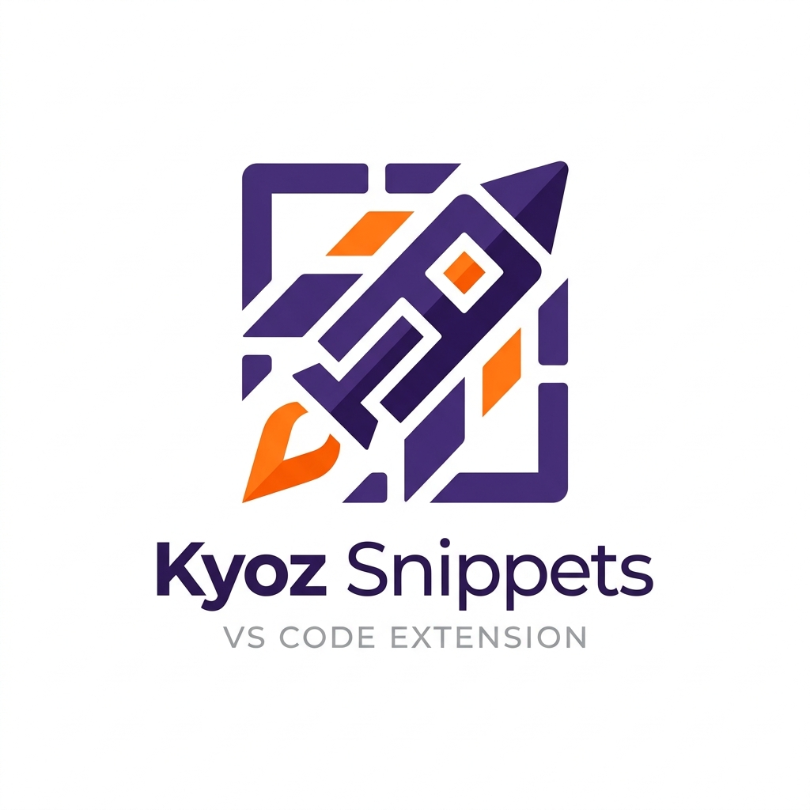

  

  # Kyoz Snippets Extension 🚀
  
Colección de snippets personales optimizados para el desarrollo moderno con <b>Hono</b>, <b>Svelte</b> y <b>Astro</b>.

---

## 📋 Tabla de Contenidos

1. [Características](#-características)
2. [Snippets Incluidos](#-snippets-incluidos)
3. [Instalación](#-instalación)
4. [Uso](#-uso)
5. [Flujo de Desarrollo (Dev)](#-flujo-de-desarrollo-dev)
6. [Flujo de Producción (Prod)](#-flujo-de-producción-prod)
7. [Licencia](#-licencia)

---

## ✨ Características

- **Tipado Estricto**: Snippets diseñados para TypeScript.
- **Productividad**: Estructuras base para rutas, componentes y páginas.
- **Ligero**: Sin dependencias innecesarias.

---

## 📦 Tecnologías Soportadas

Esta extensión proporciona una colección creciente de snippets para:

- **Hono**: Plantillas para routers, middlewares y respuestas JSON.
- **Svelte**: Estructuras de componentes, stores y hooks.
- **Astro**: Páginas base, layouts y componentes con props.

> [!TIP]
> Para ver todos los snippets disponibles, simplemente empieza a escribir en un archivo compatible (`.ts`, `.svelte`, `.astro`) y VS Code te sugerirá las opciones automáticas de **Kyoz Snippets**.

---

## 🛠️ Instalación

1. Abre **VS Code**.
2. Ve a la vista de **Extensiones** (`Ctrl+Shift+X`).
3. Busca `Kyoz Snippets`.
4. Haz clic en **Instalar**.

---

## 💡 Uso

Simplemente abre un archivo con una de las extensiones soportadas y empieza a escribir los prefijos:

| Tecnología | Prefijo             | Resultado |
| ---------- | ------------------- | --------- |
| **Hono**   | `honojs-router`     | Crea un router básico con GET y POST. |
| **Svelte** | `svelte-component`  | Genera la estructura de un componente Svelte con TS. |
| **Astro**  | `astro-page`        | Estructura básica de una página Astro con Props. |

---

## 🛠️ Contribución y Desarrollo

¿Quieres añadir tus propios snippets o mejorar la extensión? Revisa nuestra [Guía de Desarrollo](DEVELOPMENT.md).

---

## 📄 Licencia

Este proyecto se distribuye bajo la **Licencia MIT**. Consulte el archivo [LICENSE](LICENSE) para obtener más información.
